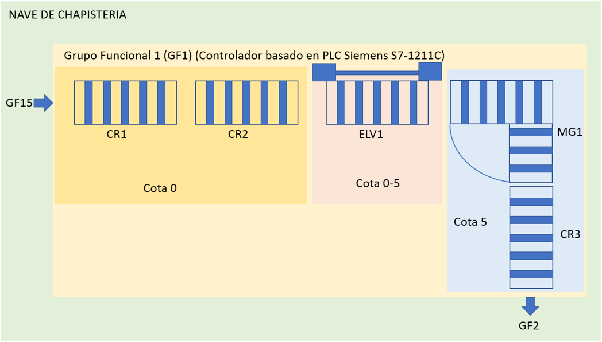

AverisasI40Arduino: Sample make with Arduino MKR1000 developed with Arduino Software IDE


This device simulates a paint booth machine, that propagate two breakdowns, connection breakdown and one more

```
Averias/Pintura/Maquinas/Laca 1/Zona 1/ESTATICA1/Fallo Boquilla 5
Averias/Pintura/Maquinas/Laca 1/Mqtt/Mqtt/Conexion
```


Chapa_GF1: Sample make with Arduino PLC Siemens S7-1200 developed with Tia Portal v14


This device simulates a conveyor in weld area, that propagate two breakdowns, connection breakdown and one more

```
Averias/Chapa/Transportadores/GF1/Cota 0/CR1/Fallo Ciclo B1
Averias/Chapa/Transportadores/GF1/Mqtt/Mqtt/Conexion
```



Averias40RBPi: Sample make with Raspberry Pi developed with NetBeans 8.2


This device simulates a conveyor in paint area, that propagate three breakdowns, connection breakdown and two more

```
Averias/Pintura/Transportadores/GF1/Cota 0/CR1/Tiempo Transito B1
Averias/Pintura/Transportadores/GF1/Cota 1/MG2/Termico Motor 1
Averias/Pintura/Transportadores/GF1/Mqtt/Mqtt/Conexion

```

