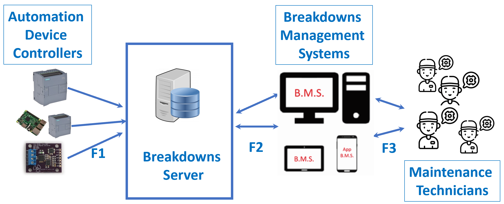

# MQTT-IIoT-BMS
A propagation breakdown management model for the IIoT

This model includes a fault propagation MQTT server capable of receiving the faults caused by the different systems,
storing and distributing them to global systems. 

As MQTT is a very light protocol, a publisher of this protocol can be integrated into the platforms with few resources. 
For example, for the prototype of our system we built three cases of automation controllers:

- PLC. Specifically, in a Siemens PLC S7-1211C.
- Micro PC. Particularly with a Raspberry Pi 3 B+ Model. 
- Microprocessor. Using an Arduino MKR 1000 Model with Wifi Module.

This selection covers exemplars for possible automation systems, and is, a good test to show the MQTT protocol flexibility in different platforms.
 
In this repository, you can find the code for this three automation controller and the code for the BMS server.  
 


For this model we propose install Mosquitto MQTT Broker: 

```
wget http://repo.mosquitto.org/debian/mosquitto-repo.gpg.key
sudo apt-key add mosquitto-repo.gpg.key
cd /etc/apt/sources.list.d/
sudo wget http://repo.mosquitto.org/debian/mosquitto-wheezy.list
sudo apt-get update
sudo apt-get install mosquitto
```
 
And as database system we use Postgre SQL:
```
sudo -u postgres psql
```
We can download the script to create database .../Server Prototype/breakdowns.sql


 
 Eduardo Buetas Sanjuan
