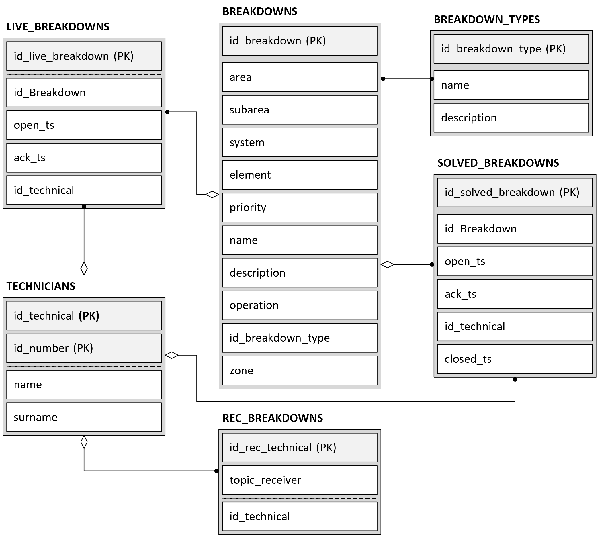
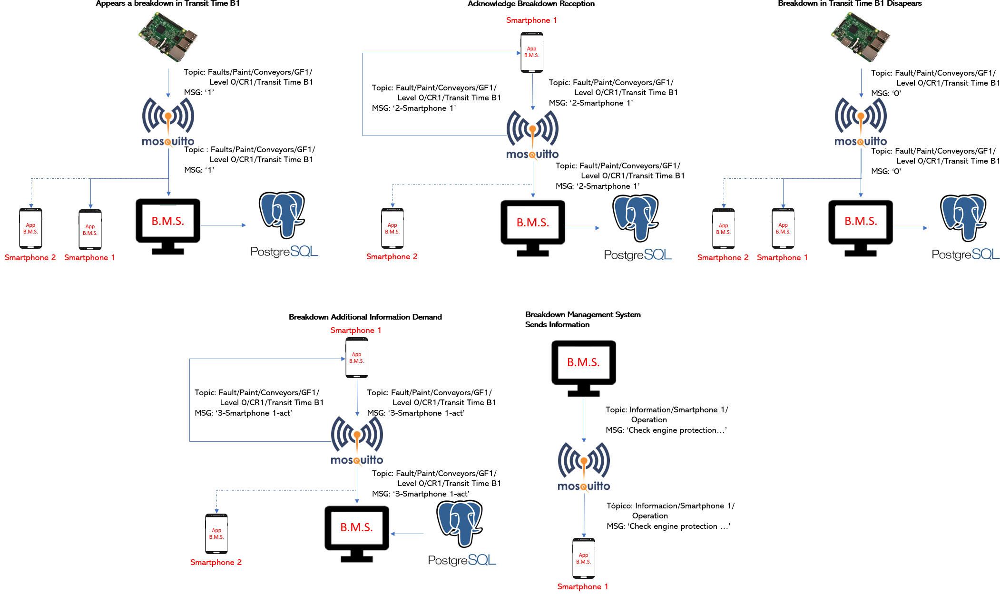

The file breakdowns.sql contains the scripts to create database for the system.

The program PropagadorAverias is maked in NetBeans 8.2 and is the Breakdown Management Server. 

To test this system you can try make the next messages:

